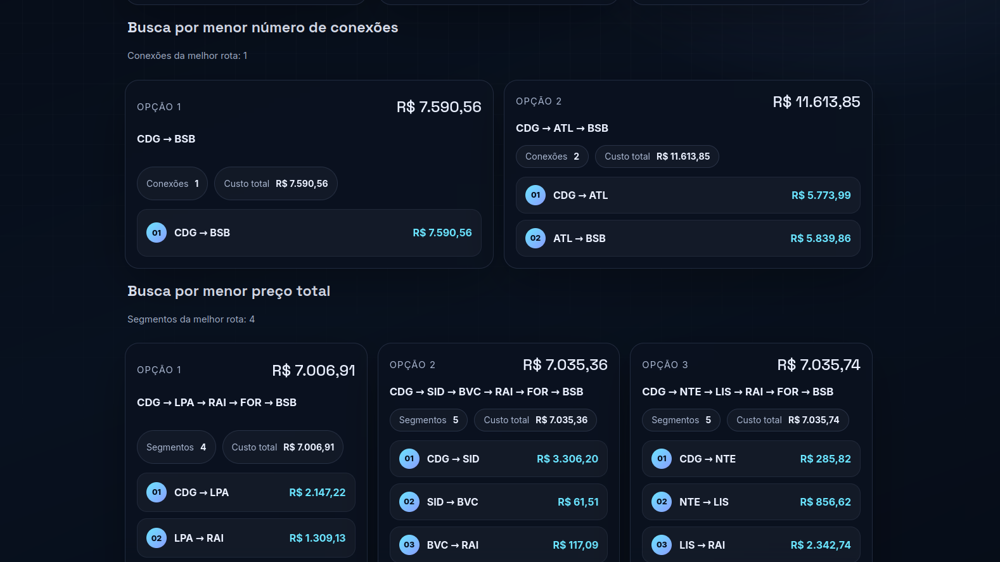
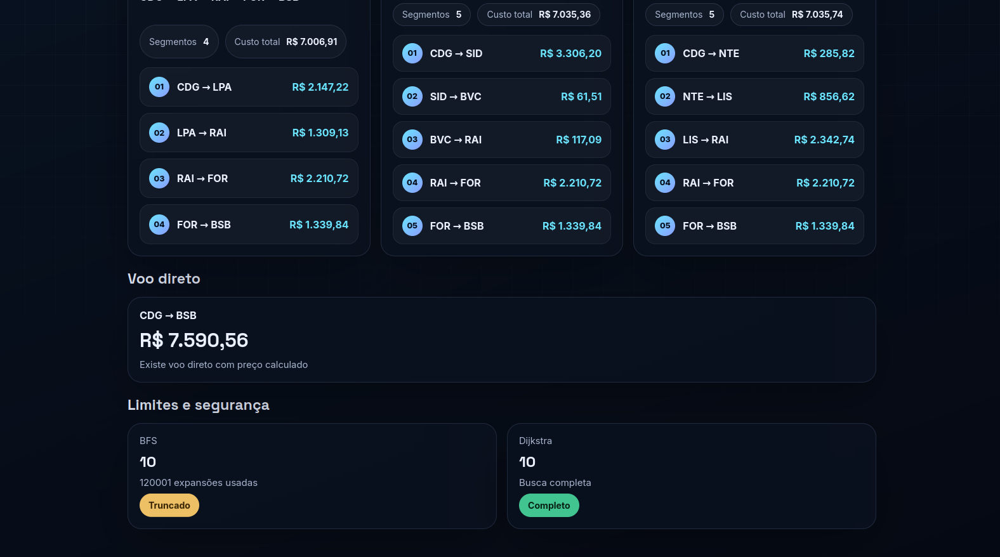

# G4_Grafos_PA-26.1

## Nome do Projeto

AeroPath - planejador de Rotas Aéreas com Grafos (BFS e Dijkstra)

Conteúdo da Disciplina: Grafos <br>

## Aluno

| Matrícula  | Aluno                               |
| ---------- | ----------------------------------- |
| 23/1027032 | Arthur Evangelista de Oliveira      |
| 23/1038303 | Yan Matheus Santa Brigida de Aguiar |

## Link da gravação

<iframe width="560" height="315" src="https://www.youtube.com/embed/urzwYSKWyO0?si=PlR9OPymo0ACmUEL" title="YouTube video player" frameborder="0" allow="accelerometer; autoplay; clipboard-write; encrypted-media; gyroscope; picture-in-picture; web-share" referrerpolicy="strict-origin-when-cross-origin" allowfullscreen></iframe>

## Sobre

Este projeto aplica conceitos de grafos para buscar rotas entre aeroportos com base em duas estratégias:

1. BFS para encontrar os caminhos com menor número de conexões.
2. Dijkstra para encontrar os caminhos de menor custo total.

Além disso, o sistema também verifica se existe voo direto entre origem e destino e exibe seu preço estimado.

O projeto oferece duas formas de uso:

1. Modo terminal (CLI), para execução interativa.
2. Aplicação web em Flask, com dashboard de resultados e autocomplete por cidade/nome de aeroporto para preencher o código IATA.

## Screenshots





## Instalação

Linguagem: **Python 3.10+**<br>
Framework (Web): **Flask**<br>

**Passo a passo (Linux/Mac/Windows):**

1. Clone o repositório ou navegue até a pasta do projeto:
   ```bash
   cd voo-dijkstra
   ```
2. (Recomendado) Crie e ative um ambiente virtual:

   ```bash
   python -m venv venv
   ```

   Linux/Mac:

   ```bash
   source venv/bin/activate
   ```

   Windows (PowerShell):

   ```powershell
   .\venv\Scripts\Activate.ps1
   ```

3. Instale a biblioteca do servidor Web (Flask):
   ```bash
   pip install flask
   ```
4. Entre na pasta da aplicação:
   ```bash
   cd voo-dijkstra
   ```

## Uso

Você pode executar o projeto de duas maneiras: Terminal (CLI) ou Interface Gráfica (Web).

### Opção 1: Via Terminal (CLI)

Essa opção busca os aeroportos digitando o IATA, o nome, a cidade ou o ICAO do aeroporto. No terminal, execute:

```bash
python main.py
```

Siga as instruções na tela informando origem e destino. A busca aceita IATA, ICAO, cidade e nome do aeroporto.

Ao final, o terminal imprime:

1. Melhor rota por menor número de conexões (BFS).
2. Informações de voo direto (quando existir).
3. Melhor rota por menor custo total (Dijkstra).

### Opção 2: Interface Gráfica (Aplicação Web)

Essa opção sobe um servidor local com interface web:

```bash
python web.py
```

Após executar este comando:

1. Abra o seu navegador web (Chrome, Edge, Firefox, etc).
2. Acesse a URL: **[http://127.0.0.1:5000](http://127.0.0.1:5000)**
3. Digite origem e destino.
4. Você pode digitar cidade/nome (ex.: Orlando) e selecionar a sugestão para preencher automaticamente o IATA.
5. Clique em "Pesquisar Rotas".

## Funcionalidades

1. Busca por menor número de conexões com BFS (retorna top 3 opções).
2. Busca por menor preço total com Dijkstra (retorna top 3 opções).
3. Verificação de voo direto e preço direto.
4. Limites de segurança na exploração dos grafos para evitar buscas excessivas.
5. Dashboard web com cards de comparação entre BFS, Dijkstra e voo direto.
6. Autocomplete de aeroportos por cidade, nome, IATA e ICAO.

## Estrutura do Projeto

```text
voo-dijkstra/
   bfs.py        -> Busca por menor numero de conexoes
   dijkstra.py   -> Busca por menor preco total
   price.py      -> Calculo de voo direto
   main.py       -> Execucao via CLI e utilitarios de carga/filtro
   web.py        -> Servidor Flask e endpoints HTTP
   data/         -> Bases de aeroportos e rotas
   templates/    -> HTML da interface
   static/       -> CSS e JavaScript da interface
```

## API (modo web)

### GET /api/rotas

Parâmetros (query string):

1. origem
2. destino

Resposta (resumo):

1. bfs: informações e rotas por menor número de conexões.
2. dijkstra: informações e rotas por menor custo.
3. direto: existência de voo direto e preço.

### GET /api/aeroportos

Parâmetros (query string):

1. q: texto parcial (cidade, nome, IATA ou ICAO).

Resposta:

Lista de sugestões com campos como iata, city, name, country e label.

## Observações

1. Os preços são estimados a partir da lógica do projeto e da base utilizada.
2. Alguns aeroportos podem compartilhar cidade/nome semelhante, então a seleção pela sugestão melhora a precisão.
3. Se não houver caminho entre origem e destino, os blocos de resultado indicarão ausência de rota.

## Outros

Projeto desenvolvido para a disciplina de Projeto de Algoritmos (UnB), com foco em modelagem de grafos e comparação de estratégias de busca de caminho.
